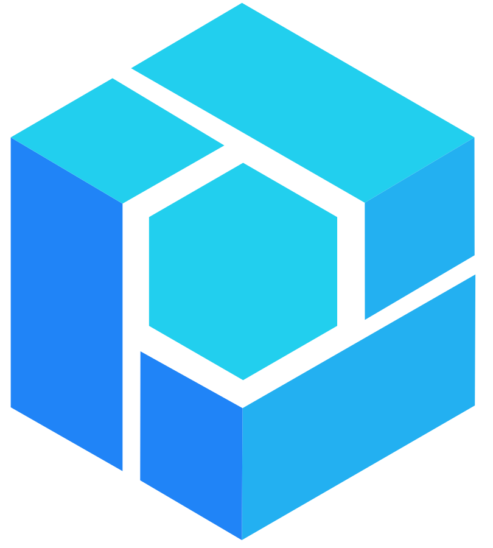

  
  <h1>NaiveTab</h1>
  
可视化键盘展示书签和浏览器指令，肌肉记忆一键直达。支持自由拖拽、深度自定义外观、专注模式、云同步。

  

    
    
  

  

    <a href="https://github.com/GXFG/newtab-naivetab/blob/main/README_EN.md">English</a> | 中文
  

  

    
    
    
    
  

---

## ⌨️ 可视化键盘 — 你的效率加速器

告别层层点击，用键盘布局管理你的浏览器。

|          | **书签键盘**                                   | **指令键盘**                                         |
|----------|------------------------------------------------|------------------------------------------------------|
| **是什么**   | 在新标签页以真实键盘布局展示你的书签                       | 通过修饰键 + 按键在浏览器任意页面执行指令                          |
| **怎么用**   | 打开新标签页，按下对应按键即可打开目标网站                      | 设置修饰键组合（如 `Ctrl+Shift`），按任意字母/数字键触发指令             |
| **可配置**   | 自定义按键映射、键盘配列、主题外观                           | 自定义指令绑定、修饰键组合、域名黑白名单                           |
| **适用场景** | 新标签页快速访问常用网站                                | 标签页管理、页面操作、滚动控制，无需鼠标                           |

## 🌟 功能特性

### 内置组件

**⏰ 时间与日期**

| 组件   | 说明                           |
|--------|--------------------------------|
| 时钟   | 数字、模拟、翻牌、霓虹四种风格         |
| 日期   | 可自定义格式与样式                 |
| 万年历 | 农历、节假日、法定假日               |

**🛠 效率工具**

| 组件      | 说明                               |
|-----------|------------------------------------|
| 搜索栏     | 自定义搜索引擎，快速检索               |
| 文件夹书签 | 网格浏览书签文件夹                   |
| 备忘录     | 记录灵感与待办                       |
| 年度进度   | 百分比 + 点阵图，感受时间流逝           |
| 天气      | 温湿度、风力、生活指数、异常预警         |
| 资讯      | 多平台热榜聚合                       |

### 核心能力

- 🖱️ **自由拖拽布局** — 组件随意放置，适配所有分辨率
- 🎨 **全参数自定义** — 字体、颜色、背景、边框、阴影，全面可调
- 🖼️ **动态壁纸** — Bing 每日壁纸 + 本地图片，随时换肤
- 🌗 **自动深色模式** — 跟随系统外观，夜间护眼
- 🎯 **专注模式** — 右键一键切换，只看需要的
- ☁️ **跨设备云同步** — 登录即同步，支持本地备份
- 🌐 **多语言** — 简体中文 + 英文
- 📖 **完全开源** — 源代码开放，欢迎贡献

## 🛠️ 立即安装

  
  
  

---

## ☕ 给作者买杯咖啡

喜欢 NaiveTab？欢迎[请我喝杯咖啡](sponsor.md)，支持持续开发！

---

## ⭐ Star History

---

  

    
     
    Made with ❤️ by GXFG
  

