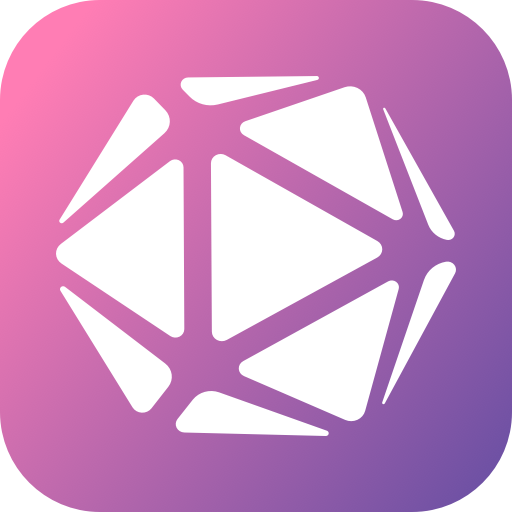

  
  <h1 align="center">NaiveTab</h1>
  
一款简单高效的浏览器新标签页扩展，支持高度自定义你的新标签页

  
<a href="https://github.com/GXFG/newtab-naivetab/blob/main/README_EN.md">English</a> | 中文

## 🌟功能特性

1. 包含以下组件：
   1. **书签**：以物理键盘的形式展示书签，快速访问对应链接。你还可以设置全局快捷键，在浏览器的任何界面打开书签，高效便捷。
   2. **文件夹书签**：以网格形式浏览原生书签文件夹，支持进入/返回文件夹、可配置图标与名称显示、布局（列数、间距、圆角、高度）可调，支持在新标签页打开。
   3. **时间与日期**：数字时钟、模拟时钟、日期显示。
   4. **万年历**：包含农历、节假日、法定假日，方便查看工作日并合理安排个人日程。
   5. **今年进度**：通过当前天数、百分比和点状图帮助你了解一年中的进度。
   6. **搜索栏**：可自定义搜索引擎，快速搜索。
   7. **备忘录**：可编辑的笔记或待办事项，支持临时记录一些信息。
   8. **天气**：查看温度、风力、湿度、每日指数等信息，异常天气会有警报提示，数据来自和风天气。
   9. **资讯**：查看头条、百度、知乎、新浪微博、V2EX 等热门资讯。
2. 以上组件可以拖拽到屏幕任意位置，完全自定义，并且兼容各种屏幕分辨率。
3. 以上组件支持自定义大部分样式，如字体、大小、颜色、背景颜色、边框、阴影、模糊等。
4. 支持自定义背景图片（Bing每日壁纸、本地图片），也可仅设置一张背景图。
5. 支持根据系统外观自动切换主题（浅色/深色），夜间浏览不再刺眼。
6. 支持专注模式：仅展示你在「设置 → 专注模式」中勾选的组件；可通过右键菜单一键开启/退出，适合沉浸式使用场景。
7. 支持多设备同步（依赖浏览器同步，需登录账号），亦可导出文件备份。
8. 支持多语言（简体中文、英文）。
9. 开源，不收集任何隐私信息或操作数据，你的所有信息都是私密的。

## 🚀快速开始

- [文档站](https://gxfg.github.io/naivetab-doc)
- [给作者买杯咖啡吧](https://github.com/GXFG/newtab-naivetab/blob/main/sponsor.md)

## 🛠️安装

- [Chrome](https://chrome.google.com/webstore/detail/naivetab-%E6%96%B0%E6%A0%87%E7%AD%BE%E9%A1%B5/hhfebdcoeoddbdhgcgflblcjcgogijem)
- [Edge](https://microsoftedge.microsoft.com/addons/detail/naivetab-%E6%96%B0%E6%A0%87%E7%AD%BE%E9%A1%B5/kejadmppkffccjopodhekdnmkofidmjl)
- [Firefox](https://addons.mozilla.org/zh-CN/firefox/addon/naivetab-%E6%96%B0%E6%A0%87%E7%AD%BE%E9%A1%B5)

## 📜更新日志

[Changelog](https://github.com/GXFG/newtab-naivetab/blob/main/CHANGELOG.md)

## 🌼致谢

- [Naive UI](https://www.naiveui.com)
- [Vitesse-webext](https://github.com/antfu/vitesse-webext)
- [icones](https://icones.js.org)
- ..
